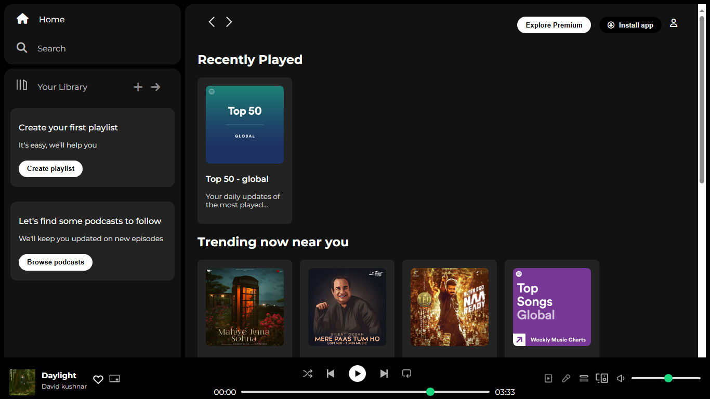

# Spotify UI Homepage Clone

A visually appealing **Spotify UI homepage clone** built using **HTML**, **CSS**, and **Font Awesome CDN**, replicating the look and feel of the original interface.

## Features

- Recreates the basic structure and design of the Spotify homepage.
- Integrated icons using **Font Awesome** for enhanced visual elements.
- Static, non-responsive layout.

## Technologies Used

 
 
 

## Note

- **This project is not fully responsive yet for small devices**. A future update will include a responsive design for mobile devices.

## Screenshot

